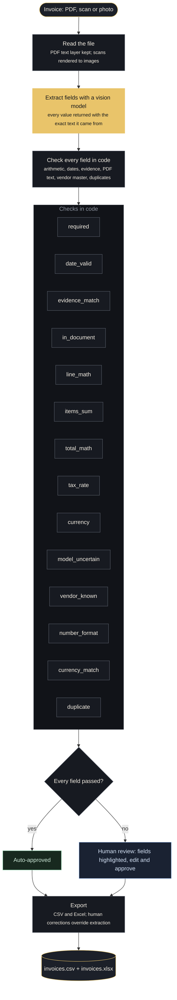

# Folio architecture

Generated by `python -m app.flowchart` from the pipeline code.

```mermaid
flowchart TD
    IN(["Invoice: PDF, scan or photo"])
    INGEST["Read the file<br/><small>PDF text layer kept; scans rendered to images</small>"]
    EXTRACT["Extract fields with a vision model<br/><small>every value returned with the exact text it came from</small>"]
    VALIDATE["Check every field in code<br/><small>arithmetic, dates, evidence, PDF text, vendor master, duplicates</small>"]
    EXPORT["Export<br/><small>CSV and Excel; human corrections override extraction</small>"]
    IN --> INGEST
    INGEST --> EXTRACT
    EXTRACT --> VALIDATE
    subgraph CK["Checks in code"]
        C_required["required"]
        C_date_valid["date_valid"]
        C_evidence_match["evidence_match"]
        C_in_document["in_document"]
        C_line_math["line_math"]
        C_items_sum["items_sum"]
        C_total_math["total_math"]
        C_tax_rate["tax_rate"]
        C_currency["currency"]
        C_model_uncertain["model_uncertain"]
        C_vendor_known["vendor_known"]
        C_number_format["number_format"]
        C_currency_match["currency_match"]
        C_duplicate["duplicate"]
    end
    VALIDATE --> CK
    ROUTE{"Every field passed?"}
    CK --> ROUTE
    AUTO["Auto-approved"]
    HUMAN["Human review: fields highlighted, edit and approve"]
    ROUTE -- yes --> AUTO
    ROUTE -- no --> HUMAN
    AUTO --> EXPORT
    HUMAN --> EXPORT
    OUT[("invoices.csv + invoices.xlsx")]
    EXPORT --> OUT

    classDef io fill:#1C2029,stroke:#E9C46A,color:#F2EDE3
    classDef ai fill:#E9C46A,stroke:#E9C46A,color:#14161B
    classDef code fill:#171A21,stroke:#5A606B,color:#F2EDE3
    classDef ok fill:#18291F,stroke:#7BC59A,color:#CFEBDA
    classDef warn fill:#2A2416,stroke:#E9C46A,color:#F5E6BF
    classDef bad fill:#2D1A17,stroke:#E4735C,color:#F6D2CA
    classDef human fill:#1A2232,stroke:#8FB3E8,color:#D6E4F8
    class IN,OUT io
    class EXTRACT ai
    class INGEST,VALIDATE,EXPORT,ROUTE code
    class C_required,C_date_valid,C_evidence_match,C_in_document,C_line_math,C_items_sum,C_total_math,C_tax_rate,C_currency,C_model_uncertain,C_vendor_known,C_number_format,C_currency_match,C_duplicate code
    class AUTO ok
    class HUMAN human
    style CK fill:#111318,stroke:#2A2F38,color:#9097A3
```
